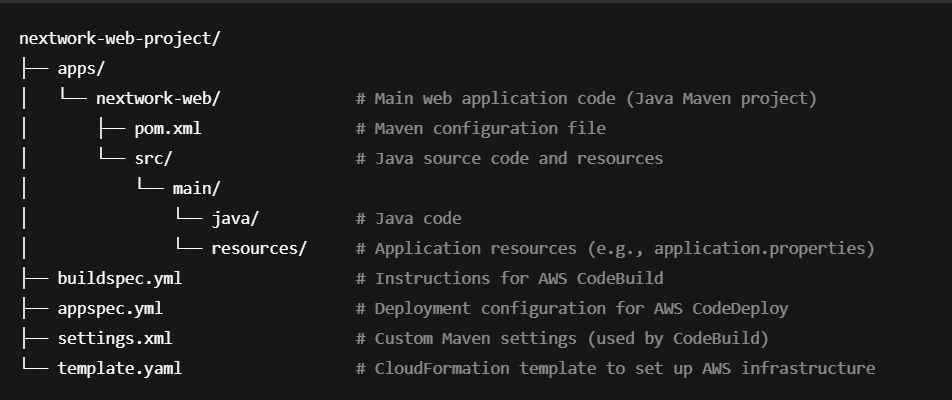

# Project Title
Build a CI/CD Pipeline with AWS

## OBJECTIVE
- The goal of this project is to implement a fully automated CI/CD pipeline using a suite of AWS services. This pipeline builds, tests, and deploys a web application every time code is pushed to GitHub, ensuring efficient and reliable delivery to a production environment.

## Tech Stack
- Services I used were EC2, VS Code, CodePipeline, CodeDeploy, CodeBuild,
 CodeArtifact, GitHub, S3, IAM, and CloudFormation.

## CI/CD Pipeline Overview
This project uses a fully automated CI/CD pipeline built with AWS services to streamline the build, test, and deployment process. Whenever code changes are pushed to the GitHub repository, the pipeline is triggered and performs the following steps:

1. GitHub acts as the source repository where the application code is stored and versioned.

2. AWS CodePipeline orchestrates the workflow, connecting all stages of the pipeline.

3. AWS CloudFormation sets up and manages the infrastructure needed for deployment.

4. AWS CodeBuild retrieves the source code, compiles it, runs tests, and packages the application.

5. The build artifact is stored in Amazon S3 for use in the deployment stage.

6. AWS CodeDeploy takes the artifact and deploys it to an Amazon EC2 instance.

7. AWS IAM manages the permissions that allow these services to interact securely with each other.

This setup ensures every code push is automatically tested, built, and deployed with minimal manual intervention.

## Project Structure

## IAM & Permissions

- CodePipeline Service Role
    - Grants access to CodeBuild, CodeDeploy, S3, and GitHub.
    - Allows CodePipeline to pass artifacts and trigger other services.

- CodeBuild Service Role
        
    - Allows downloading source code from GitHub and uploading artifacts to S3.
    - Grants permission to write logs to Amazon CloudWatch.

- CodeDeploy Service Role

    - Enables pulling artifacts from S3 and deploying to EC2 instances.

    - Executes lifecycle event scripts as defined in appspec.yml.

